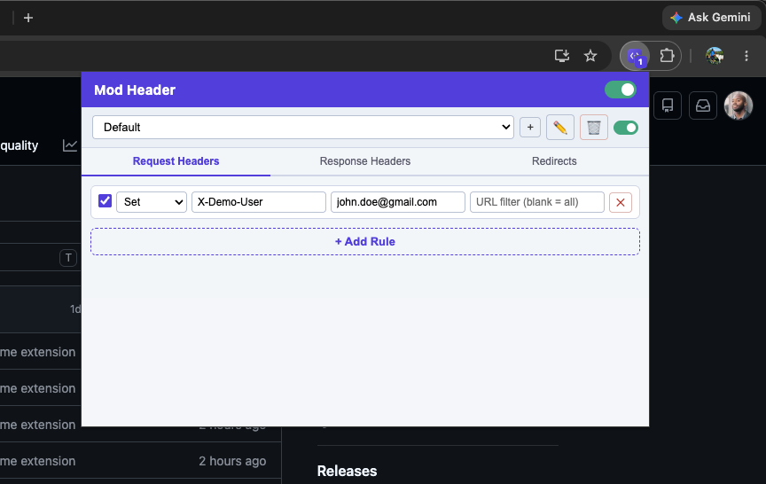
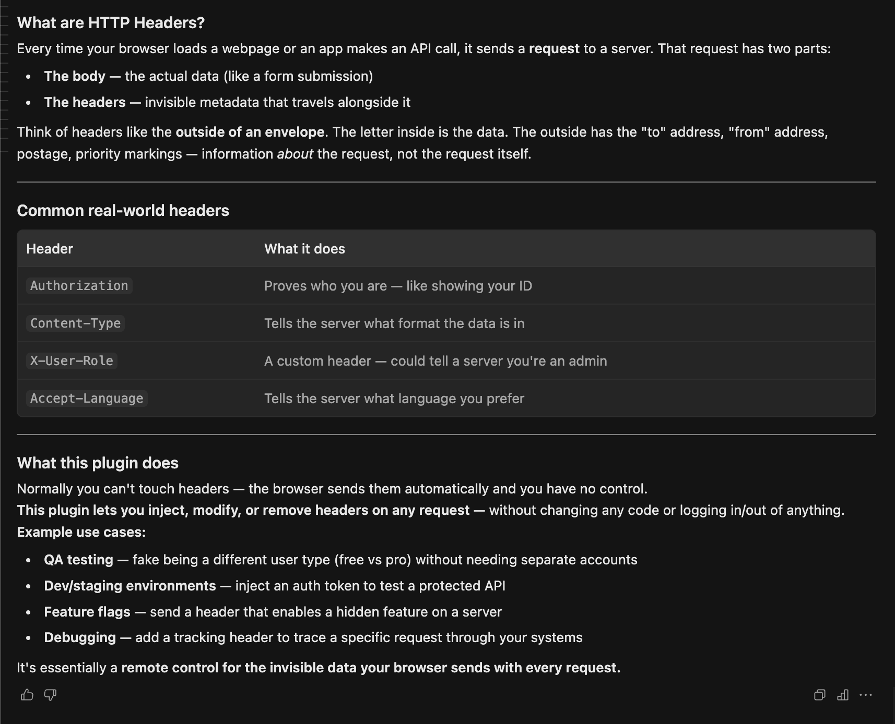

# Mod Header

A lightweight Chrome extension for setting, appending, or removing request and response headers, and for redirecting URLs — all from a toolbar popup, with no code or account changes required.

## The story

In a conversation with some engineers, I heard that a header-modifying browser extension a few of us relied on for QA and testing had stopped being available. Curious how fast I could put together a replacement, I built this from scratch with [Devin](https://devin.ai) in a matter of minutes — and it worked.

If you're not sure what HTTP headers are or why a tool like this is useful, here's a quick primer:

The browser normally sends headers on its own, with no way to intervene. This extension gives you a way in: it rewrites headers on outgoing and incoming requests on the fly, without touching any application code or signing in and out of different accounts. A few situations where that's handy:

- Testing how a page or API behaves for a different user tier by injecting the right header, instead of maintaining separate test accounts
- Hitting a protected staging or dev endpoint by attaching an auth token yourself
- Turning on a server-side feature flag that's gated behind a custom header
- Tagging outgoing requests with a marker header to trace them through logs or downstream services

In short, it's a toolbar-level remote control for the metadata your browser attaches to every request.

## Features

- **Request & response headers** — set, append, or remove any header, per rule
- **Redirects** — rewrite matched URLs to a different destination
- **Per-rule URL filters** — scope a rule to specific requests, or leave blank to apply everywhere
- **Multiple profiles** — group rules into named, independently toggleable profiles (e.g. "Staging", "QA - Pro User")
- **Global and per-profile enable/disable** — flip everything off in one click without losing your rules
- **Live rule-count badge** — the toolbar icon shows how many rules are currently active

## Installation

1. Clone or download this repository
2. Open `chrome://extensions` in Chrome
3. Enable **Developer mode** (top right)
4. Click **Load unpacked** and select the project folder
5. Pin the extension and click its icon to start adding rules

## Tech stack

- Manifest V3
- [`declarativeNetRequest`](https://developer.chrome.com/docs/extensions/reference/api/declarativeNetRequest) for header/redirect rules — no network interception, no background request inspection
- Vanilla JS, HTML, and CSS — no build step, no dependencies
- `chrome.storage.local` for persisting profiles and rules

## Disclaimer

This is a personal project built for my own testing workflow and shared here as a portfolio piece. It isn't affiliated with or endorsed by any employer.
